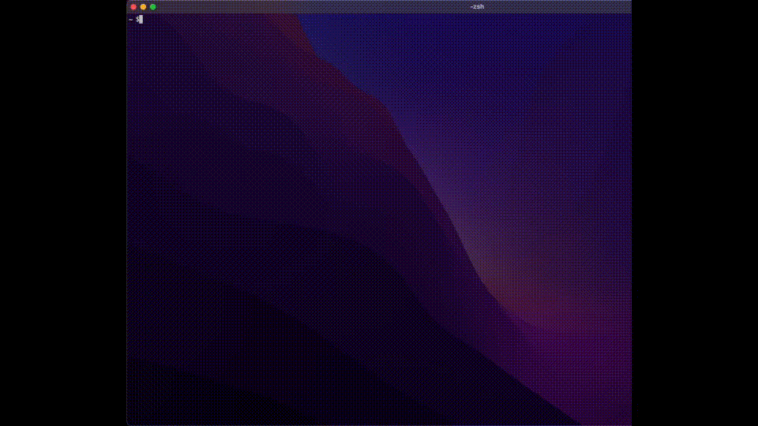

# kon

 

Display fox image in the terminal.

## Install

cargo

```sh
cargo install kon
```

Homebrew

```sh
brew tap Doarakko/homebrew-tap
brew install kon
```

## Usage

```sh
kon
```



## Release

```sh
# 1. Update version in Cargo.toml
# 2. Create and push tag
git tag v0.1.2
git push origin v0.1.2
# 3. Download tar.gz from release assets and get sha256
gh release download v0.1.3 --repo Doarakko/kon --pattern "*.tar.gz" --dir /tmp
shasum -a 256 /tmp/kon-*.tar.gz
# 4. Update version and sha256 in https://github.com/Doarakko/homebrew-tap/blob/main/Formula/kon.rb
```

## Credit

- [RandomFox](https://randomfox.ca/)
